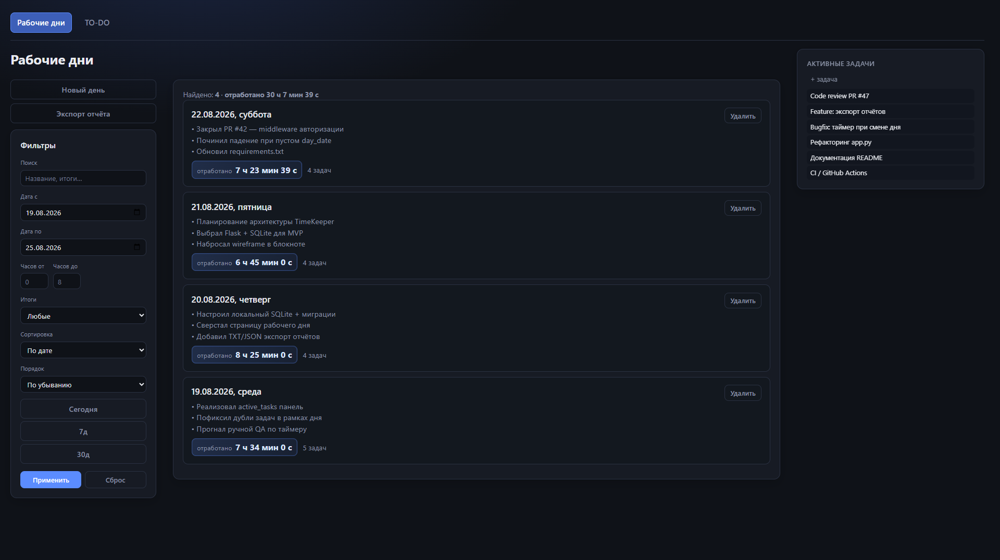
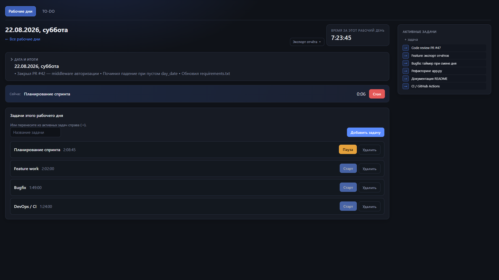
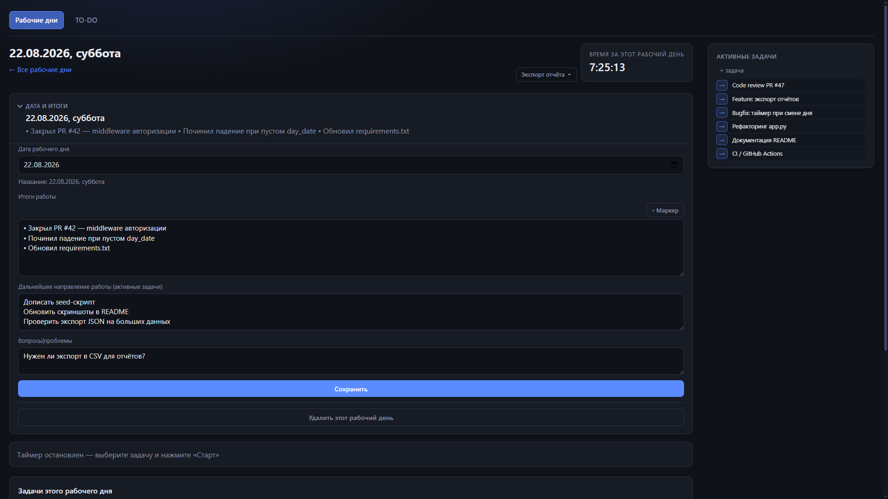
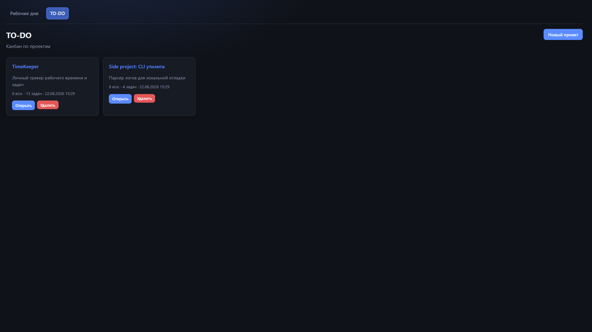
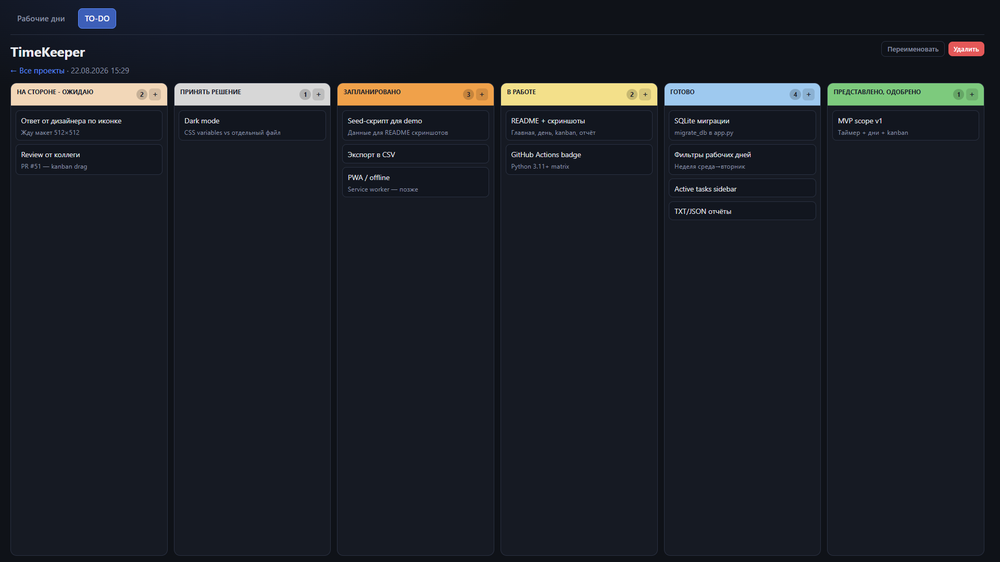

<h1 align="center" style="font-size:4em;">TimeKeeper</h1>
<p align="center" style="font-size:1.5em;"><b>- персональная система контроля рабочего процесса</b></p>

<p align="center">
  
</p>


## Возможности:
> - Запуск и остановка отсчёта времени по каждой задаче помогают отслеживать результаты и время, затраченное на их выполнение.
> - Отдельный блок для фиксации актуальных задач позволяет всегда держать в фокусе самые важные из них.
> - Результаты работы удобно сохранять в отчётах: в форматах PNG и TXT.
> - Система Kanban упрощает учёт рабочих задач, распределяя нагрузку при работе над глобальными проектами или при планировании работы в команде.
> - Отдельный таймер обратного отсчёта с сигналами (не входит в учёт рабочего дня).
> - Граф знаний со связями через `[[вики-ссылки]]` (в т.ч. импорт из TO-DO по кнопке).
> - Тема (светлая / тёмная) и несколько визуальных стилей в настройках.


## Установка

```bash
git clone https://github.com/codemed7-git/TimeKeeper.git
cd TimeKeeper

python -m venv venv

venv\Scripts\activate

source venv/bin/activate

pip install -r requirements.txt

python app.py
```

Откройте браузер и перейдите по адресу: http://127.0.0.1:7777/

При первом запуске создаётся пустая база `timekeeper.db` (только схема таблиц).  
После `git pull` при следующем запуске применяются только миграции схемы; данные появляются, когда вы сами создаёте дни, задачи, проекты и т.д.  
Файл `timekeeper.db` в репозиторий не входит.


## Интерфейс

### Рабочие дни

<p align="center">
  
</p>
<p align="center"><i>Список рабочих дней с фильтрами и активными задачами</i></p>

<p align="center">
  
</p>
<p align="center"><i>Учёт времени по задачам в течение рабочего дня</i></p>

<p align="center">
  
</p>
<p align="center"><i>Фиксация итогов, планов и вопросов по дню</i></p>

### TO-DO

<p align="center">
  
</p>
<p align="center"><i>Канбан по проектам - обзор всех досок</i></p>

<p align="center">
  
</p>
<p align="center"><i>Канбан-доска отдельного проекта</i></p>
